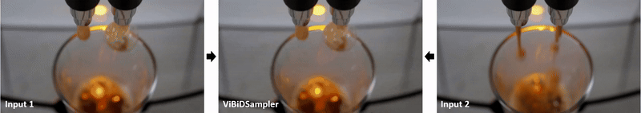

# ViBiDSampler: Enhancing Video Interpolation Using Bidirectional Diffusion Sampler (ICLR 2025)

[Paper](https://arxiv.org/abs/2410.05651) | [Project page](https://vibidsampler.github.io/)

This repository is the official PyTorch implementation of "ViBiDSampler: Enhancing Video Interpolation Using Bidirectional Diffusion Sampler".

<p align="center" width="100%">
    
</p>


## How to use
### 1. Environment setting
Our source code relies on [generative-models](https://github.com/Stability-AI/generative-models). Please clone the generatvie-models, and then place ```vibidsampler.py``` to the directory ```scripts/sampling```.
Follow the environment setting from the [generative-models](https://github.com/Stability-AI/generative-models).

### 2. Pre-trained model
Download the Stable Video Diffusion (SVD-XT) weights from [here](https://huggingface.co/stabilityai/stable-video-diffusion-img2vid-xt). \
Specify the path to the downloaded model in the ```ckpt_path``` field of ```scripts/sampling/configs/svd_xt.yaml```.

### 3. Video interpolation
In order to inference, run:
```
python scripts/sampling/vibidsampler.py
```
+ The paths to the source frames should be specified using the flags ```input_start_path``` and ```input_end_path```.
+ You can adjust the ```fps_id``` (approximately between 6 and 24) according to the specific use case.


## Citation

```
@inproceedings{
yang2025vibidsampler,
title={ViBiDSampler: Enhancing Video Interpolation Using Bidirectional Diffusion Sampler},
author={Yang, Serin and Kwon, Taesung and Ye, Jong Chul},
booktitle={The Thirteenth International Conference on Learning Representations},
year={2025},
url={https://openreview.net/forum?id=nNYA7tcJSE}
}
```
